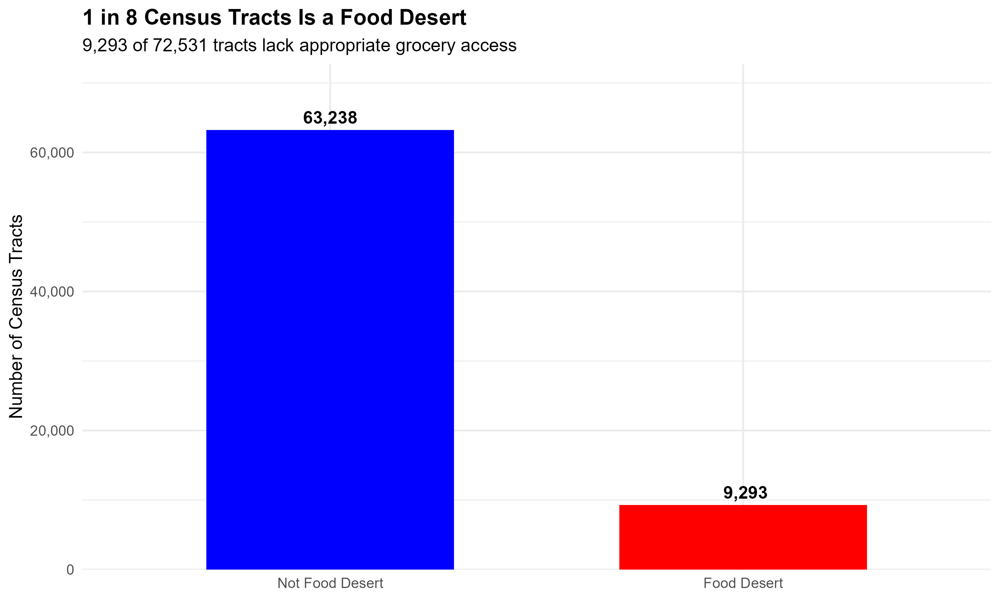
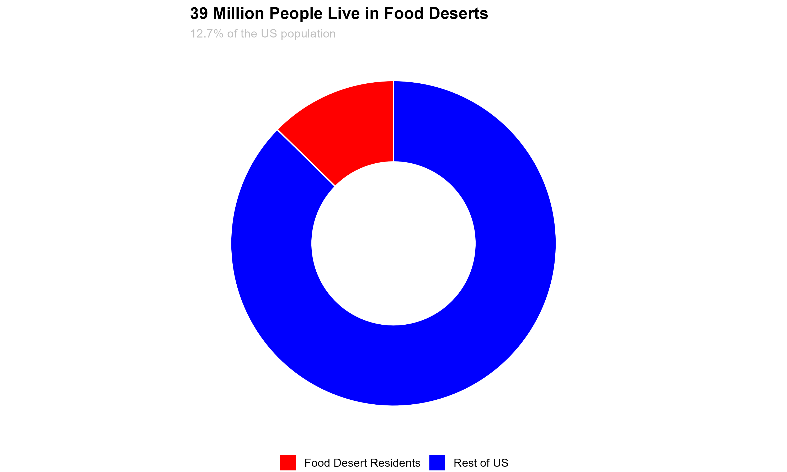
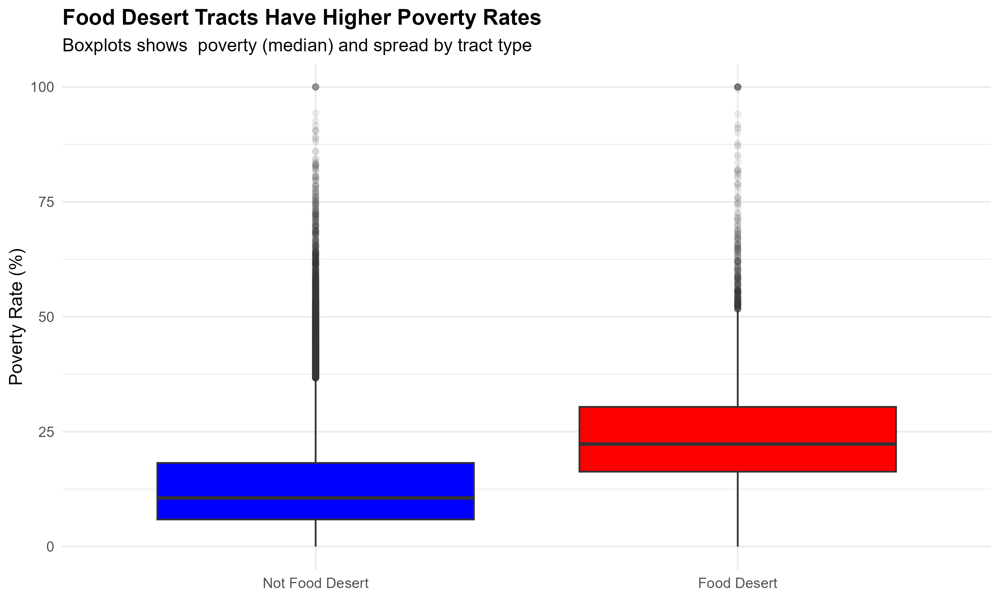
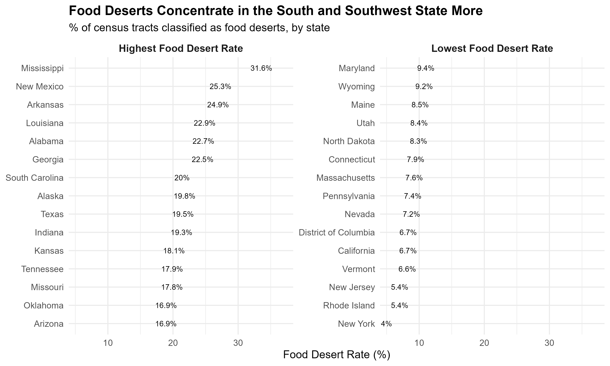

# 🍽️ Food Deserts in the USA

## 📌 Overview
This project analyzes **food deserts in the United States** using the USDA Food Access Research Atlas dataset.

A **food desert** is defined as a low-income census tract where access to supermarkets is limited  
(>1 mile in urban areas or >10 miles in rural areas).

The goal of this project is to understand:
- How widespread food deserts are  
- Who is most affected  
- What factors contribute to food access inequality  

---

## 📊 Key Visualizations

### 1. Distribution of Food Desert Tracts

**Insight:**
- 9,293 out of 72,531 tracts (~12.8%) are food deserts  
- Roughly **1 in 8 census tracts** lack proper grocery access  

---

### 2. Population Living in Food Deserts

**Insight:**
- ~39 million people live in food deserts  
- About **12.7% of the US population** is affected  

---

### 3. Poverty Comparison

**Insight:**
- Food desert areas have significantly higher poverty  
- Median poverty:
  - Food Desert: ~20–25%  
  - Non-Food Desert: ~10–15%  

---

### 4. State-Level Food Desert Distribution

**Insight:**
- Food deserts are **heavily concentrated in the South and Southwest**
- Highest:
  - Mississippi (~31.6%)
  - New Mexico (~25.3%)
  - Arkansas (~24.9%)
- Lowest:
  - New York (~4%)
  - New Jersey (~5.4%)
  - Vermont (~6.6%)

👉 Shows **clear geographic inequality**

---

## 🔍 Key Findings

### 1. Food Deserts Are Common
- Affect ~12.8% of census tracts  
- Impact ~39 million Americans  

### 2. Urban Areas Are More Affected
- Urban: ~14.4%  
- Rural: ~7.8%  
- Cities have nearly **2× higher food desert rate**

### 3. Income Drives Food Access
- Low-income areas are up to **10× more likely** to be food deserts  

### 4. Transportation Is Critical
- Lack of vehicle access significantly increases risk  
- Food access depends on both **distance + mobility**

### 5. SNAP Dependency Is Higher
- Food desert areas show higher SNAP participation  
- Even at the same poverty level, dependency is higher  

---

## 🧠 Dataset

- **Source:** USDA Food Access Research Atlas (2019)  
- **Size:** 72,531 census tracts  
- **Variables:** 147  

Includes:
- Population & demographics  
- Poverty & income  
- Vehicle access  
- SNAP participation  
- Distance to grocery stores  

---

## ⚙️ Technologies Used

### Programming Language
- R

### Libraries
- tidyverse (dplyr, ggplot2, readr)
- scales
- patchwork

### Techniques
- Data Cleaning  
- Feature Engineering  
- Exploratory Data Analysis (EDA)  
- Data Visualization  

---

## 🧹 Data Processing

- Converted binary indicators to categorical labels  
- Created:
  - `FoodDesert`  
  - `AreaType`  
- Engineered features:
  - Poverty bins  
  - Vehicle access %  
  - SNAP %  
  - Demographic percentages  
- Handled missing values safely  

---

## 🚫 Limitations

- Static dataset (2019 only)  
- No real-time updates  
- Food access measured by **distance only**  
- Does not capture:
  - Food quality  
  - Pricing  
  - Store availability changes  

---

## 🚀 Future Work

- Add time-series analysis  
- Build ML models for prediction  
- Integrate geospatial mapping  
- Include real-time grocery/store data  
- Analyze policy impact (SNAP, subsidies)  

---

## 💡 Conclusion

Food deserts are not random — they are strongly linked to:
- Income inequality  
- Transportation access  
- Urban infrastructure  
- Regional disparities  

Solving this problem requires **system-level interventions**, not just more grocery stores.

---

## 👨‍💻 Author
**Priyank Patel**  
MS Computer Science
